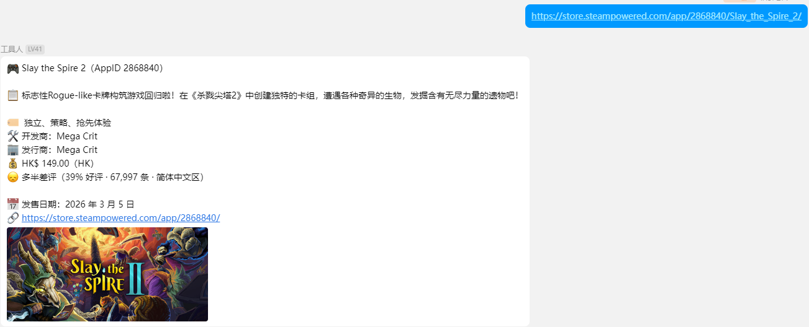

# astrbot_plugin_steamstore_sniper

<p align="center">
  <b>🎮 AstrBot Steam 商店速查插件</b><br>
  通过 AppID 或商店链接快速查询 Steam 游戏信息，支持封面图、简介、多地区价格、分语言区评测。
</p>

<p align="center">
  
  
  
  
</p>

---

## 功能概览

| 功能 | 说明 |
|---|---|
| 游戏详情查询 | 输入 AppID 或商店链接，返回封面、简介、类型、开发商、价格、评测、发售日期 |
| 多地区价格查询 | 指定任意 Steam 地区代码（HK / US / CN / JP …）实时查询价格及折扣 |
| 评测语言区筛选 | 支持按简中 / 繁中 / 日语 / 英语 / 全部 分区统计好评率 |
| 会话级语言区切换 | `/steam_rlang` 切换当前会话的评测统计语言，单次查询也可内联指定 |
| URL 自动解析 | 白名单会话中发送 Steam 商店链接即自动触发查询，无需输入指令 |
| 游戏截图查询 | `/steam_shots` 发送游戏截图，含成人内容自动防护 |
| 访问控制（ACL） | 支持白名单 / 黑名单 / 关闭三种模式，按 UMO 精确控制使用权限 |

---

## 快速开始

### 1. 安装

**方式一：通过 AstrBot 插件市场安装（推荐）**

在 AstrBot WebUI 中进入 **插件市场**，搜索 `steamstore_sniper`，点击安装，等待完成后重启即可。

**方式二：手动安装**

```bash
# 进入 AstrBot 插件目录
cd data/plugins/

# 克隆仓库
git clone https://github.com/NorNeko/astrbot_plugin_steamstore_sniper.git
```

完成后在 WebUI 插件管理页面启用 **Steam 商店速查**，重启 AstrBot 生效。

### 2. 依赖

插件启动时会自动安装以下依赖，无需手动操作：

```
aiohttp>=3.9.0    # 异步 HTTP 客户端
Pillow>=10.0.0    # 截图功能图像处理（/steam_shots 指令）
```

### 3. 配置

安装完成后，在 WebUI 插件配置页面按需填写以下项目：

| 配置项 | 必填 | 说明 |
|---|---|---|
| **默认地区** (`default_cc`) | 推荐 | 查询价格时的默认地区，如 `hk`、`us`、`cn` |
| **代理地址** (`proxy`) | 推荐 | 国内用户必须配置，如 `http://127.0.0.1:7890` |
| 访问控制模式 (`acl_mode`) | 可选 | `Off` / `Whitelist` / `Blacklist`，默认关闭 |
| URL 自动解析 (`auto_parse_enabled`) | 可选 | 开启后在授权会话中发送链接自动触发查询 |

> 完整配置项说明见文末 [WebUI 配置项](#webui-配置项) 表格。

---

## 指令

| 指令 | 说明 |
|---|---|
| `/steam {appid}` | 通过 AppID 查询游戏详情 |
| `/steam {appid} {语言代码}` | 查询时临时指定本次评测语言区 |
| `/steam_price {appid} {地区}` | 指定地区查询价格，如 `/steam_price 730 us` |
| `/steam_rlang {语言代码}` | 切换当前会话的评测统计语言区 |
| `/steam_rlang` | 查看当前语言区设置与可选值 |
| `/steam_shots {appid}` | 查询游戏截图（最多 N 张，WebUI 可配置） |
| `/steam help` | 显示指令帮助 |

**评测语言代码**：`schinese`（简体中文区）/ `tchinese`（繁体中文区）/ `japanese`（日语区）/ `english`（英语区）/ `all`（全部语言）

**商店链接支持格式示例**：
```
https://store.steampowered.com/app/2868840/Slay_the_Spire_2/
https://store.steampowered.com/app/2989760/_/
```

---

## 输出示例

```

```

---

## WebUI 配置项

| 配置项 | 类型 | 默认值 | 说明 |
|---|---|---|---|
| `default_cc` | 字符串 | `hk` | 默认查询地区（hk / cn / us / jp / tw / sg） |
| `default_lang` | 字符串 | `schinese` | 游戏信息显示语言 |
| `review_lang` | 字符串 | `schinese` | 默认评测统计语言区 |
| `request_timeout` | 整数 | `10` | 请求超时秒数（5–30） |
| `proxy` | 字符串 | — | 代理地址，如 `http://127.0.0.1:7897`，留空禁用 |
| `max_description_length` | 整数 | `200` | 简介最大字符数，0 = 不截断 |
| `acl_mode` | 字符串 | `Off` | 访问控制模式：`Off` / `Whitelist` / `Blacklist` |
| `allowed_list` | 列表 | — | Whitelist 模式下允许使用的 UMO 列表 |
| `banned_list` | 列表 | — | Blacklist 模式下拒绝使用的 UMO 列表 |
| `auto_parse_enabled` | 布尔 | `false` | 启用后，通过 ACL 的会话发送商店链接将自动解析 |
| `block_adult_screenshots` | 布尔 | `true` | 屏蔽成人游戏的截图（`/steam_shots` 拒绝响应） |
| `max_screenshots` | 整数 | `6` | `/steam_shots` 每次最多发送的截图张数（1–9） |

> **获取会话 UMO**：向机器人发送 `/sid`，即可查看当前会话的唯一标识符，用于填写 `allowed_list` / `banned_list`。

---

## URL 自动解析配置示例

希望在某个群聊中只要发送 Steam 链接就自动触发查询：

1. `acl_mode` 设为 `Whitelist`
2. `allowed_list` 填入目标群 UMO，如 `aiocqhttp:GroupMessage:123456789`
3. `auto_parse_enabled` 设为 `true`

---

## 数据来源

- 游戏详情：[Steam Store API `appdetails`](https://store.steampowered.com/api/appdetails)（公开接口）
- 评测摘要：[Steam Store API `appreviews`](https://store.steampowered.com/appreviews)（公开接口）

---

## 未来计划
- 增加可自选输出美化图片+文本排版的纯图片输出的功能，增加美观度和便捷性
- 实现简单的网页截图功能，作为部分信息无法满足的补充
- 增加对游戏商店页面相关捆绑包和DLC的显示
- 增加SteamDB等第三方数据库的查询选项，作为信息补充，获取历史低价等公开接口无法提供的数据。

## 许可

MIT License
